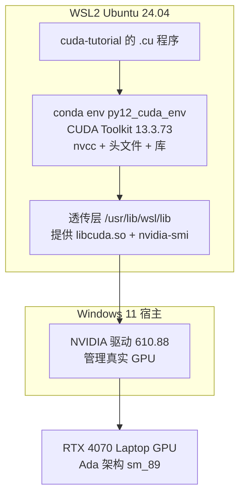
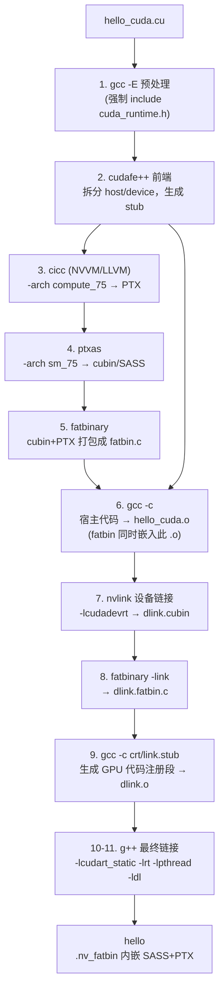
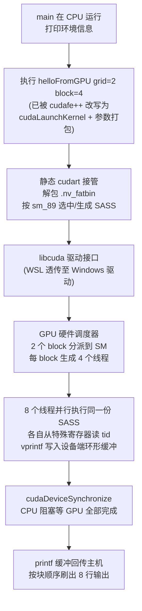

# CUDA 开发环境与 nvcc 编译链路调研报告

- 日期：2026-09-02
- 任务书：`doc/plan/20260902_调研conda安装的cuda环境.md`
- 实测环境：
  - WSL2 Ubuntu 24.04.4（主机名 candy，x86_64）
  - GPU：NVIDIA GeForce RTX 4070 Laptop（Ada 架构，计算能力 **8.9 / sm_89**）
  - 驱动：610.88（装在 Windows 侧，WSL 通过 `/usr/lib/wsl/lib` 透传）
  - CUDA Toolkit：**13.3.73**（conda env `~/miniconda3/envs/py12_cuda_env`，Python 3.12.14）
- 文中所有命令输出均为在本机实测采集，非转述文档。

---

## 0. 结论速览

| 问题 | 一句话结论 |
|---|---|
| 环境介绍 | CUDA 环境分三层：**驱动（Windows）→ 透传层（WSL）→ Toolkit（conda env）**；当前环境开箱即用 |
| nvcc 功能 | nvcc 是一个"编译驱动器"，统筹 gcc、cicc、ptxas、fatbinary、nvlink 等十几个子工具 |
| 编译链接链路 | 一次 `nvcc hello.cu -o hello` 内部实际执行了 **11 步**子命令，产出 CPU 代码 + GPU 代码并打包进同一个可执行文件 |
| nvcc vs gcc | 核心区别：一次编译**两套目标机器代码**（x86-64 + GPU SASS/PTX），并需处理 kernel 启动语法改写、fatbin 嵌入、PTX 前向兼容 |
| 最小执行链路 | `hello_cuda.cu`：CPU 执行 main → 改写后的 `cudaLaunchKernel` → 驱动 → GPU 调度 2×4=8 个线程并行执行 SASS → printf 缓冲回传 → `cudaDeviceSynchronize()` 后输出 |

---

## 1. CUDA 开发环境介绍

### 1.1 总体分层



关键认知：**WSL 里永远不要装 Linux 显卡驱动**。驱动只装在 Windows 侧，WSL 通过 9p 文件系统从 `/usr/lib/wsl/lib` 拿到 `libcuda.so`（驱动 API）和 `nvidia-smi`。conda 里装的是纯用户态的 Toolkit（编译器+库），二者职责不重叠。

### 1.2 conda 环境里到底装了什么

`~/miniconda3/envs/py12_cuda_env` 的结构（实测）：

| 路径 | 内容 | 来自哪个 conda 包 |
|---|---|---|
| `bin/nvcc` | 编译驱动器本体 | cuda-nvcc 13.3.73 |
| `bin/ptxas` | PTX → SASS 汇编器 | cuda-nvcc |
| `bin/cudafe++` | CUDA 前端，拆分 host/device 代码 | cuda-nvcc |
| `bin/fatbinary` | 把多种 GPU 代码打包成 fatbin | cuda-nvcc |
| `bin/nvlink` | 设备侧链接器 | cuda-nvcc |
| `bin/cuobjdump`、`bin/nvdisasm` | 查看/反汇编 GPU 二进制 | cuda-cuobjdump / cuda-nvdisasm（调研时补装） |
| `nvvm/bin/cicc` | NVVM 编译器（基于 LLVM），生成 PTX | cuda-nvvm-impl |
| `targets/x86_64-linux/include/` | **84 个头文件**：`cuda_runtime.h`、`crt/`、`cooperative_groups/`、`cccl/`(Thrust) | cuda-cudart-dev、cuda-cccl 等 |
| `targets/x86_64-linux/lib/` | `libcudart.so.13.3.29`、`libcudart_static.a`、`libcudadevrt.a`、`stubs/` | cuda-cudart(-dev) |

### 1.3 `#include <cuda_runtime.h>` 是从哪来的

这是 `cuda_runtime.h` 在磁盘上的真实位置（实测）：

```
~/miniconda3/envs/py12_cuda_env/targets/x86_64-linux/include/cuda_runtime.h
```

但编译时**从来不需要手动写 `-I`**。用 `nvcc -v` 抓到的实际参数：

```
#$ INCLUDES="-I.../envs/py12_cuda_env/bin/../targets/x86_64-linux/include"
#$ SYSTEM_INCLUDES="-isystem" ".../targets/x86_64-linux/include/cccl"
#$ LIBRARIES="-L.../targets/x86_64-linux/lib/stubs" "-L.../targets/x86_64-linux/lib"
```

机制：nvcc 启动时先读同目录的 `nvcc.profile` 配置，以**自身可执行文件的位置**为锚点推算出 `TOP = bin/../targets/x86_64-linux`，再由 `TOP` 派生出 include/lib 搜索路径。这就是为什么"激活哪个 conda 环境，就必须用那个环境里的 nvcc"——换 nvcc 就换了一整套路径。

`#include <...>` 的完整查找顺序：

1. nvcc 内置路径（`targets/x86_64-linux/include`，最优先）
2. `-I` 用户指定路径
3. `CPATH` 环境变量
4. 系统路径（`/usr/include` 等）

`#include "..."` 则先搜"当前正在编译的文件所在目录"，再走上面的顺序。查看某个编译实际用了哪些路径的方法：

```bash
nvcc -v hello_cuda.cu -o /dev/null 2>&1 | grep -- '-I'
```

链接库同理：`-lcudart` 会在 `LIBRARIES` 声明的目录里解析。所以后续课程需要 cuBLAS 时，`conda install -c nvidia cuda-cublas-dev=13.3` 装完，`nvcc -lcublas` 直接可用。

### 1.4 环境自检三件套

```bash
nvidia-smi                 # 驱动透传是否正常(应显示 RTX 4070)
nvcc --version             # 工具链版本(13.3, V13.3.73)
nvcc hello_cuda.cu -o hello && ./hello   # 编译运行冒烟测试
```

---

## 2. nvcc 命令行功能调研

### 2.1 定位：nvcc 是"编译驱动器"而非编译器本体

`nvcc` 自身不实现 C++ 编译——宿主代码部分它调用系统的 `gcc/g++`，设备代码部分调用自家的 `cicc`（NVVM）和 `ptxas`。nvcc 的职责是**理解 `.cu` 的双重身份，编排整条流水线**（见第 3 节的 11 步实测轨迹）。

### 2.2 常用选项分组（全部实测存在）

**控制编译到哪个阶段 / 产出什么**：

| 选项 | 作用 | 本机实测结果 |
|---|---|---|
| `-E` | 只预处理 | — |
| `-c` | 编译成 .o（内嵌 GPU 代码） | — |
| `-ptx` | 生成 PTX（NVIDIA 中间汇编） | hello_cuda.cu → 60 行 PTX |
| `-cubin` | 生成 GPU 真机二进制 | sm_89 cubin 共 4032 字节 |
| `-fatbin` | 打包 fatbin | — |
| `-cuda` | 把 .cu 拆成中间 C++（观察编译器改写的窗口） | 产出 1.86 MB 的 `.cu.cpp.ii` |
| `-res-usage` | 报告资源占用 | — |

**指定目标 GPU 架构**（最重要的选项族）：

| 选项 | 说明 |
|---|---|
| `-arch=sm_89` | 真实架构（real arch）：生成该卡能直接跑的 SASS |
| `-arch=compute_89` | 虚拟架构（virtual arch）：只生成 PTX，装卡时由驱动 JIT |
| `-gencode=arch=compute_89,code=sm_89` | 精细控制，可重复出现，一个 fatbin 塞多个架构 |
| `-arch=native` | 按本机 GPU 自动选择（推荐日常用） |
| `--list-gpu-arch` | 列出支持的架构（本机支持到 compute_121） |

实测差异：`-arch=native` 编出的文件内嵌 **2 份 sm_89 ELF、0 份 PTX**；默认（见 2.3）编出 sm_75 SASS + sm_75 PTX。**PTX 是前向兼容的保险**——新卡没有匹配 SASS 时，驱动拿 PTX 现场编译。

**链接相关**：

| 选项 | 说明 |
|---|---|
| `-cudart=static/shared/none` | cudart 链接方式，**默认 static**（见 4.3 实证） |
| `-rdc=true` | 可重定位设备代码（动态并行、跨文件 kernel 必需） |
| `-dc` / `-dlink` | 分离编译：设备代码先编成 .o，最后统一设备链接 |
| `-L` / `-l` | 传给宿主链接器（如 `-lcublas`） |

**调试与调优**：

| 选项 | 说明 |
|---|---|
| `-g` / `-G` | 宿主/设备调试信息（`-G` 会明显劣化性能，只在调试时开） |
| `-lineinfo` | 只加行号信息给 Nsight Compute 用，不劣化性能 |
| `--maxrregcount=N` | 限制每线程寄存器数（影响占用率） |
| `-Xcompiler "-fPIC"` | 透传参数给 gcc |
| `-Xptxas -v` / `--ptxas-options=-v` | 让 ptxas 报告寄存器用量（实测：helloFromGPU 用 24 个寄存器、8 字节栈） |
| `--run` | 编译后立即运行 |

### 2.3 本机注意点：默认架构偏旧

实测 `nvcc` **不带 -arch 时默认编译到 sm_75**（Turing，2018 年），轨迹里 `__CUDA_ARCH_LIST__=750`。而本机 4070 是 **sm_89**——运行时靠 fatbin 里的 PTX 由驱动 JIT 出 sm_89 SASS 兜底，能用但首次启动慢、且用不上新架构特性。

**建议本仓库日常编译加 `-arch=native`**：

```bash
nvcc -arch=native vector_add.cu -o vector_add
```

### 2.4 本仓库 CLAUDE.md 中特殊编译命令的解释

- `nvcc -lcublas 11_matrix_multiply.cu` —— 链接 cuBLAS 数学库（需先 `conda install -c nvidia cuda-cublas-dev=13.3`）
- `nvcc -rdc=true -lcudadevrt 13_dynamic_parallelism.cu` —— 开启可重定位设备代码并链接**设备端运行时**（动态并行：kernel 里再起 kernel，需要 GPU 上有一个迷你调度器，即 libcudadevrt）

---

## 3. nvcc 如何把 .cu 编译链接成可执行程序（实测轨迹）

### 3.1 .cu 文件的双重身份

一个 .cu 文件里混着两种代码：跑在 CPU 上的普通 C++（`main`），和跑在 GPU 上的 `__global__` 函数。nvcc 的工作就是把它们**拆开、分别编译、再缝合回一个文件**。

### 3.2 实测：一次 nvcc 命令实际执行的 11 步

`nvcc -v hello_cuda.cu -o hello` 抓到的完整命令序列（简化自真实输出）：



几个值得注意的细节：

- **预处理做了两遍**：第 1 步给宿主侧用（只定义 `__CUDACC__`），第 3 步给设备侧用（额外定义 `__CUDA_ARCH__=750`，设备代码靠这个宏知道自己在为哪代 GPU 编译）。
- `cudafe++` 是语法改写核心：它把 `helloFromGPU<<<2,4>>>()` 从宿主代码里抹掉，替换成对 `cudaLaunchKernel` 的调用，并生成把 kernel 登记到运行时的 stub 代码。
- **cicc 即 NVVM**：基于 LLVM 的设备编译器，把中间表示优化后输出 PTX（实测 PTX 头部写着 `Based on NVVM 7.0.1`、`.version 9.3`）。
- `ptxas` 是真正的"GPU 汇编器"：PTX → SASS，同时分配寄存器（本例 24 个）。
- 最终 g++ 链接的是**静态 cudart**（`-lcudart_static`）——所以 `ldd hello` 里看不到 libcudart.so，1 MB 的可执行文件里大头就是它。

### 3.3 中间产物速查

| 产物 | 生成命令 | 用途 |
|---|---|---|
| `.ptx`（60 行） | `nvcc -ptx hello_cuda.cu` | 虚拟机汇编，可读性最好，适合研究优化 |
| `.cubin`（4 KB） | `nvcc -cubin -arch=sm_89 ...` | 真机 SASS 二进制 |
| `hello_cuda.cu.cpp.ii`（1.86 MB） | `nvcc -cuda hello_cuda.cu` | 拆分后的中间 C++，可看到所有改写 |
| fatbin | `nvcc -fatbin ...` | 分发用的 GPU 代码容器 |

### 3.4 GPU 代码藏在可执行文件的哪里

用 `cuobjdump` 检查编出的 `hello`（实测）：

```
$ cuobjdump --list-elf hello
ELF file    1: hello.1.sm_75.cubin      ← 编译产物
ELF file    2: hello.2.sm_75.cubin      ← 设备链接(dlink)产物
$ cuobjdump --list-ptx hello
PTX file    1: hello.1.sm_75.ptx

$ readelf -S hello | grep fatbin
[18] .nv_fatbin        PROGBITS ...
[30] .nvFatBinSegment  PROGBITS ...
```

GPU 的 SASS 和 PTX 就以 fatbin 格式躺在 ELF 的 `.nv_fatbin` 段里，随可执行文件一起分发；运行时由 cudart 解包、按 GPU 型号挑最合适的镜像加载。

### 3.5 源码一行 → SASS 的对应关系

对 helloFromGPU 反汇编（`nvdisasm -c hello.cubin`），源码 `int tid = threadIdx.x + blockIdx.x * blockDim.x;` 对应的机器码清晰可辨：

```
S2R  R0, SR_TID.X                 ; 读特殊寄存器: threadIdx.x
S2R  R3, SR_CTAID.X               ; 读特殊寄存器: blockIdx.x
IMAD R0, R3, c[0x0][0x0], R0      ; tid = blockIdx.x * blockDim.x(存在常量区 c[0x0]) + threadIdx.x
```

`SR_TID.X`/`SR_CTAID.X` 是 GPU 硬件提供的特殊寄存器——线程索引是硬件"发"给每个线程的，这就是 CUDA 并行模型的硬件根基。

---

## 4. nvcc 编译 vs gcc/g++ 编译的区别

| 维度 | gcc/g++ | nvcc |
|---|---|---|
| 输入 | C/C++，所有代码跑在 CPU | .cu：CPU 代码 + GPU 代码混合 |
| 目标机器 | 一套（x86-64） | **两套**：x86-64 + GPU（PTX/SASS），打包进同一文件 |
| 本体 | 自己就是编译器 | 编译驱动器：编排 gcc + cicc + ptxas + fatbinary + nvlink |
| 语言扩展 | 标准 C++ | `__global__`/`__device__`/`<<<>>>`，由 cudafe++ 改写 |
| 优化器 | GCC 自身 | 宿主侧复用 GCC；设备侧 NVVM(LLVM) + ptxas |
| 运行库 | libc/libstdc++ | 额外 cudart（默认静态链接）+ 可选 libcudadevrt |
| 兼容策略 | 二进制依赖 libc 版本 | fatbin 内含 PTX → 驱动可对新卡 JIT，天然前向兼容 |
| 链接模型 | 单一链接 | 双层链接：nvlink 设备链接 + 宿主链接（分离编译时更明显） |

两个容易忽略的点：

1. **静态 cudart 默认值**：`ldd hello` 实测只有 libstdc++/libgcc/libc，没有 libcudart——`--cudart=static` 是默认值。好处是单文件免依赖；代价是每个可执行文件自带一份运行时（约 1 MB）。
2. **nvcc 与系统 gcc 有版本配对表**：CUDA 13.3 支持到较新的 gcc，但配错版本会报 `unsupported GNU version`。conda 环境里实测用的是系统 gcc 13.3，正好匹配。

---

## 5. hello_cuda.cu 最小执行链路

### 5.1 源码结构回顾（42 行做对了五件事）

```c
__global__ void helloFromGPU() {                    // ① 声明:GPU 上运行,CPU 可调用
    int tid = threadIdx.x + blockIdx.x * blockDim.x; // ② 全局线程编号
    printf("Hello from GPU! 线程 ID: %d\n", tid);    // ③ 设备端 printf
}
int main() {
    helloFromGPU<<<2, 4>>>();   // ④ 执行配置:2 个 block × 4 线程(编译期被改写)
    cudaDeviceSynchronize();    // ⑤ 等 GPU 做完(不加这行可能一行都打印不出来)
    cudaGetLastError();         //   检查启动是否失败
}
```

### 5.2 从敲下回车到 8 行输出的全链路



### 5.3 输出解读与线程索引

实测输出 8 行，`tid` 取值 0~7，来源是公式 `tid = threadIdx.x + blockIdx.x * blockDim.x`：

| blockIdx.x | threadIdx.x | tid |
|---|---|---|
| 0 | 0,1,2,3 | 0,1,2,3 |
| 1 | 0,1,2,3 | 4,5,6,7 |

这正是 CLAUDE.md 里"标准线程配置"公式的最小实例：`全局tid = 局部tid + 块号 × 块大小`，推广到大网格就是 `1D 索引 = threadIdx.x + blockIdx.x * blockDim.x`（2D/3D 各维同理展开）。

两个初学要点：

- **kernel 启动是异步的**：`<<<2,4>>>()` 立即返回，CPU 继续往下跑。没有 `cudaDeviceSynchronize()` 时 main 可能先退出，GPU 的 printf 缓冲来不及回传，表现为"一行都没打印"。
- **并发打印无严格全局顺序**：本例输出恰好按 tid 有序，是因为块数少；块一多时各块完成顺序不定，输出可能交错。

### 5.4 复现命令

```bash
conda activate py12_cuda_env
cd /mnt/d/Programs/20260901_cuda_code_learn/cuda-tutorial
nvcc -arch=native hello_cuda.cu -o /tmp/hello && /tmp/hello
```

---

## 6. 附录

### 6.1 环境快照（实测）

```
$ nvcc --version
Cuda compilation tools, release 13.3, V13.3.73
Build cuda_13.3.r13.3/compiler.38244171_0

$ nvidia-smi --query-gpu=name,compute_cap --format=csv,noheader
NVIDIA GeForce RTX 4070 Laptop GPU, 8.9

$ nvcc --list-gpu-arch | tail -5     # 支持的真实/虚拟架构上限
compute_100  compute_110  compute_103  compute_120  compute_121
```

conda 包清单（CUDA 相关）：cuda-nvcc 13.3.73、cuda-cudart(-dev/-static) 13.3.29、cuda-cccl 13.3.3（Thrust/CUB）、cuda-nvvm-impl 13.3.73、cuda-crt-* 13.3.73、cuda-cuobjdump、cuda-nvdisasm。

### 6.2 本报告实验的复现命令

```bash
P=~/miniconda3/envs/py12_cuda_env
export PATH="$P/bin:$PATH"

nvcc -v hello_cuda.cu -o /tmp/hello 2>&1 | grep '^#'   # 11 步编译轨迹
nvcc -ptx hello_cuda.cu -o /tmp/hello.ptx              # 看可读的 GPU 汇编
nvcc -cuda hello_cuda.cu                               # 拆分后的中间 C++
cuobjdump --list-elf /tmp/hello                        # 可执行文件里嵌的 GPU 代码
readelf -S /tmp/hello | grep fatbin                    # fatbin 所在 section
nvdisasm -c hello.cubin | less                         # SASS 反汇编
```

### 6.3 参考资料

- CUDA nvcc 编译器手册（含 nvcc.profile 与全部选项）：https://docs.nvidia.com/cuda/cuda-compiler-driver-nvcc/
- CUDA 编译指南（分离编译、fatbin、JIT）：https://docs.nvidia.com/cuda/cuda-c-compilation/
- CUDA C++ 编程指南（执行模型、线程层级）：https://docs.nvidia.com/cuda/cuda-c-programming/
- PTX ISA 文档（SR_TID 等特殊寄存器）：https://docs.nvidia.com/cuda/parallel-thread-execution/
- conda 环境说明：NVIDIA conda channel 自 2026-08 停止更新（存量包可继续安装），后续版本转 Anaconda defaults / conda-forge 渠道
