# CUDA 教程构建修复与 conda 环境配置梳理

- 日期：2026-09-02
- 环境：WSL2 Ubuntu 24.04 / RTX 4070 Laptop（sm_89）/ conda env `py12_cuda_env`（CUDA 13.3.73）
- 起因：`./build.sh` 全量构建失败，CMake 报 6 个 `CUDA::xxx` 目标不存在
- 结果：33 个可执行文件全部编译通过（sm_89 原生 SASS），`environment.yaml` 重建
- 关联文档：`20260902_cuda开发环境与nvcc编译链路调研报告.md`（编译链路原理）

---

## 0. 结论速览

| 问题 | 根因 | 修复 |
|---|---|---|
| `CUDA::cublas` 等目标不存在 | 环境缺 4 个数学库；且 nvidia channel 旧包名已随渠道迁移移除 | 用 defaults 渠道新命名 `libcublas-dev` 等安装，`cuda-version=13.3` 做总约束 |
| 缺库导致 CMake configure 致命错误 | CMakeLists.txt 对 `CUDA::xxx` 链接无守卫 | 全部加 `if(TARGET ...)` 守卫，缺库优雅跳过 |
| 架构被钉在 sm_75，28 课 `cp.async` 编不过 | 架构自动检测逻辑**从未生效过**（CMake 3.20+ 行为变化） | CUDASetup.cmake 改为默认强制 nvidia-smi 检测 |

```mermaid
graph TB
    A["./build.sh 失败<br/>CUDA::cublas 等目标不存在"]
    B["根因1: 环境缺 4 个数学库"]
    C["根因2: CMakeLists 缺守卫"]
    D["根因3: 架构被钉在 sm_75"]
    A --> B
    A --> C
    A --> D
    B --> B1["conda search 查清渠道迁移<br/>新命名 + cuda-version 约束安装"]
    C --> C1["if TARGET 守卫<br/>缺库时优雅跳过"]
    D --> D1["检测逻辑从未生效<br/>改为默认强制检测 sm_89"]
    B1 --> E["全量重建通过<br/>33 个可执行文件"]
    C1 --> E
    D1 --> E
    E --> F["冒烟测试: cuBLAS / cuFFT 真实运行通过"]
```



---

## 1. 问题现象

`./build.sh` 在 configure 阶段报 6 处同类错误：

```
CMake Error at CMakeLists.txt:72 (target_link_libraries):
  Target "11_matrix_multiply" links to: CUDA::cublas
  but the target was not found.
# 同样错误: 17_cufft(CUDA::cufft), 18_cusparse(CUDA::cusparse),
#           19_curand(CUDA::curand), 32(CUDA::cufft), 33(CUDA::curand)
CMake Generate step failed.  Build files cannot be regenerated correctly.
```

背景知识：`CUDA::cublas` 这类 imported target 由 `find_package(CUDAToolkit)` 在**找到对应库文件时**才创建。环境里没装 cuBLAS → 目标不存在 → `target_link_libraries` 直接报错。cuDNN/OpenGL 之所以没报错，是因为 CMakeLists 对它们做了 `find_library` + 条件跳过（第 16/21 课显示 skipping）。

---

## 2. 根因与修复

### 2.1 根因一：环境缺 4 个数学库（含渠道迁移的坑）

**安装时踩到的关键事实：**

1. 2026-08 起 NVIDIA conda channel 停止更新，包迁移到 Anaconda defaults / conda-forge
2. **包名变了**：`conda search cuda-cublas-dev` 在 nvidia channel 和 defaults 都查无此包；新命名在 defaults 渠道，叫 **`libcublas-dev`**（同理 `libcufft-dev` / `libcurand-dev` / `libcusparse-dev`）
3. **版本号体系变了**：各库不再跟随 CUDA 版本号，独立演进（见下表）
4. defaults 的这些包**不带 `cuda-version` 运行依赖**，仅加约束时求解器仍会挑最新版（实测装到了 cublas 13.6）

**最终安装命令：**

```bash
conda install -n py12_cuda_env \
    libcublas-dev libcufft-dev libcurand-dev libcusparse-dev "cuda-version=13.3"
```

**实际装到的版本（与 CUDA 13.3 工具链共存验证可用）：**

| 库 | 版本 | 说明 |
|---|---|---|
| libcublas(-dev) | 13.6.0.2 | 比工具链新，13 大版本内 API 兼容，驱动 610.88 足够新，运行正常 |
| libcufft(-dev) | 12.3.0.29 | |
| libcurand(-dev) | 10.4.3.29 | |
| libcusparse(-dev) | 12.8.2.51 | |
| libnvjitlink / cuda-nvrtc | 13.3.33 | 作为依赖自动带入 |

库文件同时落在 `$PREFIX/lib/` 和 `$PREFIX/targets/x86_64-linux/lib/`，CMake 的 `find_package(CUDAToolkit)` 能直接找到。

### 2.2 根因二：CMakeLists.txt 缺守卫

修复模式与文件中已有的 cuDNN/OpenGL 处理保持一致：

```cmake
# 修复前 (缺库 = configure 直接失败)
add_executable(11_matrix_multiply 11_matrix_multiply.cu)
target_link_libraries(11_matrix_multiply PRIVATE CUDA::cublas)

# 修复后 (缺库 = 打印 skip 并跳过)
if(TARGET CUDA::cublas)
    add_executable(11_matrix_multiply 11_matrix_multiply.cu)
    target_link_libraries(11_matrix_multiply PRIVATE CUDA::cublas)
else()
    message(STATUS "cuBLAS not found, skipping 11_matrix_multiply")
endif()
```

共修 7 处：`11(cublas)`、`17(cufft)`、`18(cusparse)`、`19(curand)`、`22(cuda_driver)`、`32(cufft)`、`33(curand)`。注意分组目标（`practical/libraries/high_level/frontier`）里硬编码的目标列表也要同步改成条件 `list(APPEND ...)`，否则跳过单个教程时分组目标会引用不存在的目标。

### 2.3 根因三：架构检测从未生效（最有意思的 bug）

**现象链**：配置摘要显示 `CUDA Architectures: 75` → 28 课的 `cp.async` PTX 指令报 `requires .target sm_80 or higher` 编译失败；且所有程序都在为 2018 年的 Turing 编译，本机 sm_89 只能靠驱动 JIT 兜底。

**机理**：CUDASetup.cmake 原逻辑是

```cmake
if(NOT DEFINED CMAKE_CUDA_ARCHITECTURES)   # ← 永远为假!
    ...nvidia-smi 检测...
endif()
```

CMake 3.20+ 在启用 CUDA 语言时会把 `CMAKE_CUDA_ARCHITECTURES` **自动初始化为编译器默认架构**（nvcc 13.x 默认就是 sm_75，见编译链路报告 §2.3），所以 `DEFINED` 恒真，检测代码成了死代码。第一版修复尝试比较 `CMAKE_CUDA_ARCHITECTURES STREQUAL CMAKE_CUDA_COMPILER_DEFAULT`，实测该变量取值与预期不符仍未命中。

**最终修复**：放弃"猜测用户是否指定过"，改为默认强制检测 + 显式开关退出：

```cmake
if(NOT CUDA_TUTORIAL_SKIP_ARCH_DETECT)   # 想手动指定: -DCUDA_TUTORIAL_SKIP_ARCH_DETECT=ON
    execute_process(COMMAND nvidia-smi --query-gpu=compute_cap ...)  # → sm_89
endif()
```

修复后配置摘要正确输出 `Auto-detected GPU architecture: sm_89`，28 课随架构修正自然编过。

---

## 3. 过程中的两个操作坑

| 坑 | 现象 | 教训 |
|---|---|---|
| **假成功** | 从 Windows Git Bash 内联调 `wsl.exe bash -c '/home/.../conda install ... \| tail'`，路径被 MSYS 层改写成 `D:/ProgramFiles/Git/home/...`，命令实际没执行；管道 `tail` 又把退出码洗成 0，任务显示"完成" | 复杂 WSL 命令一律写成脚本文件再 `bash` 执行；不要用管道吞掉关键退出码 |
| **未激活环境** | 直接跑 build.sh 报"未找到 nvcc"——交互终端里 conda 环境是激活的，脚本环境里不是 | build.sh 依赖激活环境；自动化场景先 `source ~/miniconda3/etc/profile.d/conda.sh && conda activate py12_cuda_env` |

---

## 4. 最终状态（实测）

```
BUILD_EXIT=0
-- Auto-detected GPU architecture: sm_89
-- CUDA Version: 13.3.73
-- CUDA Architectures: 89
build/bin/ 下 33 个可执行文件
```

- 冒烟测试：`11_matrix_multiply`（cuBLAS）、`17_cufft`（cuFFT）真实运行通过
- 仅两个可选教程跳过，补装方式：
  - 16 课 cuDNN：`conda install -n py12_cuda_env cudnn=9.*`（约 700MB）
  - 21 课 OpenGL：`sudo apt install freeglut3-dev libglu1-mesa-dev`
- 构建日志里的 `Clock skew detected` 警告无害：代码在 `/mnt/d`（Windows 盘），WSL 与 Windows 时间戳有亚秒级偏差

---

## 5. environment.yaml 的设计取舍

选择记录"**用户视角**"的包清单而非 `conda env export` 全量快照：

- 全量导出混着 `gcc_impl_linux-64`、`sysroot_linux-64` 等实现细节包，跨机器/跨 gcc 版本求解易碎
- 精简版只记显式选择的包 + 双位数版本（如 `libcublas-dev=13.6`），头部放 `cuda-version=13.3` 总约束
- 附使用注释：创建/激活/构建命令、cuDNN 补装、渠道迁移说明

```yaml
name: py12_cuda_env
channels: [defaults, nvidia]
dependencies:
  - python=3.12
  - cuda-version=13.3        # 总约束: nvcc/cudart/nvrtc 版本配套
  - cuda-nvcc=13.3
  - cuda-cudart-dev=13.3
  - cuda-cccl
  - libcublas-dev=13.6
  - libcufft-dev=12.3
  - libcurand-dev=10.4
  - libcusparse-dev=12.8
  # ...完整版见仓库根目录 environment.yaml
```

---

## 6. 知识沉淀

### 6.1 conda 渠道迁移对照（2026-08）

| 旧（nvidia channel，已停更） | 新（defaults 渠道） |
|---|---|
| `cuda-cublas-dev` | `libcublas-dev` |
| `cuda-cufft-dev` | `libcufft-dev` |
| `cuda-curand-dev` | `libcurand-dev` |
| `libcusparse-dev` | `libcusparse-dev` |
| 版本号 ≈ CUDA 版本 | **各库独立版本号**（cublas 13.x / cufft 12.x / curand 10.x / cusparse 12.x） |

用 `cuda-version=13.x` 约束保证核心组件配套；注意 defaults 的 lib 包不感知该约束，装完要 `conda list` 核对版本。

### 6.2 conda 方案下"新电脑的 CUDA 版本"是什么

conda 让 toolkit 跟着环境走，机器本身只剩两个属性：

| 机器属性 | 影响 | 查看方式 |
|---|---|---|
| 驱动版本 | 能运行多新的 CUDA 程序（上限）；`nvidia-smi` 右上角的 CUDA Version 就是这个上限 | `nvidia-smi` |
| GPU 计算能力 | 编译目标架构、可用指令 | `nvidia-smi --query-gpu=compute_cap` |

- 驱动只支持到 13.0（580.x）：**编译不受影响**（nvcc 全程纯 CPU 工作，不碰驱动）；运行靠 minor version compatibility 大概率可用，稳妥做法是升级驱动，或把 yaml 的三处 pin 降到 13.0
- 系统里装了别的 toolkit（/usr/local/cuda-13.0）：无影响，conda 环境的 PATH 优先
- GPU 太老（Pascal 及以前）：CUDA 13 已不支持（最低 sm_75），需降到 CUDA 12 环境

### 6.3 常用命令备忘

```bash
# 环境
conda env create -f environment.yaml && conda activate py12_cuda_env
conda search -c conda-forge "libcublas-dev"        # 查某库有哪些版本

# 构建 (需先激活环境)
./build.sh rebuild            # 清理后全量重建
./build.sh run 05_shared_memory   # 编译并运行单课
./build.sh list               # 列出目标

# 排查
grep -E "Auto-detected|CUDA Architectures" build/.../CMakeCache.txt 附近日志
nvidia-smi --query-gpu=compute_cap --format=csv,noheader
```
